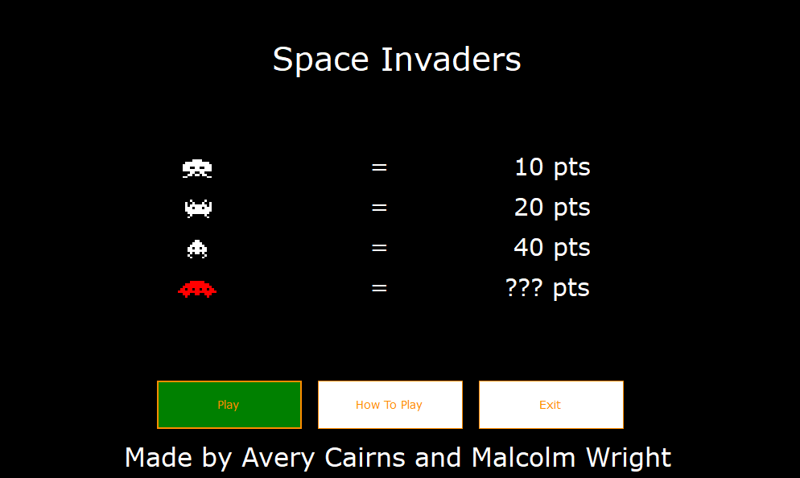

# Space Invaders
This is a C# remake of Space Invaders written using Visual Studio. This was my final project for Grade 11 Computer Science.
Each wall has health, and it slowly deteriorates as it gets shot. After all the aliens are gone, the level resets and you 
can continue playing.

## Demo

You will need to use Microsoft Visual Studio 15 or higher to build and run.